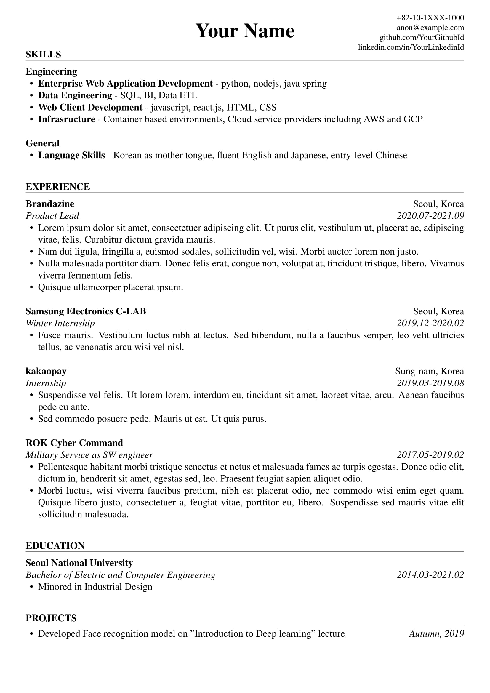

# Brutal Resume

Extremely slim Latex resume template. This will save your 2-3 minutes finding template, fiddling font sizes and so on.

## Why you should consider using this template

* just one [class file](./resume.cls) with <= 50 loc

    Easy to fix these and those. You don't have to be Latex expert to write your resume.
* public domain

    You don't have to concern about silly things e.g. adding annotation in your pdf for license. We are not a lawyer but an engineer anyway.

